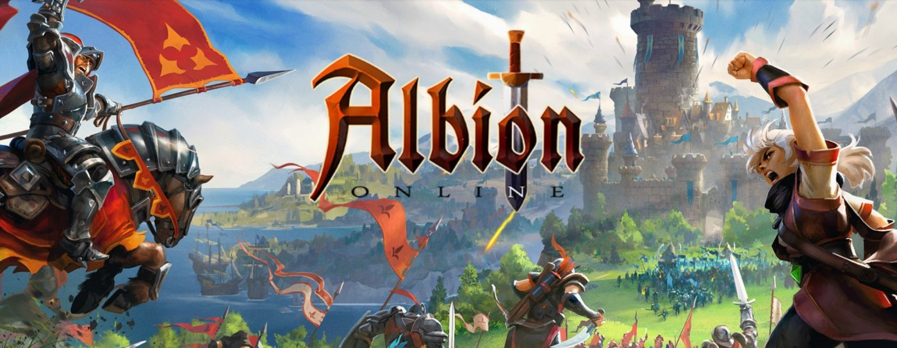

# Albion-Online-Guide

Dưới đây là một số hướng dẫn cơ bản được tổng hợp từ albion online wiki nhằm giúp các bạn nhanh chóng nắm bắt được với hệ thống gameplay của Albion Online. Các bạn có thể sử dụng thẻ Issues ở phía trên để đưa ra các góp ý, nhận xét nhằm giúp hoàn thiện bài hướng dẫn này.

#### Hệ thống Gameplay & Kinh tế

###### Nghề Khai thác (Gathering)

​	

[Câu]: gameplay/fishing.md	"Câu cá (Fisherman)"

​	Khai khoáng (Ore Miner)

​	Chặt gỗ (Lumberjack)

​	Gặt bông (Fiber Harvester)

​	Khai thác đá (Quarrier)

​	Lột da (Animal Skinner)

###### Nghề Sản xuất (Production)

​	Chế tạo Trang bị (Crafting)

​	Tinh chế Nguyên liệu (Refining)

​	Nâng cấp Tier Trang bị (Enchanting)

​	Chế tạo Runes, Souls, Relics (Melding)

​	Đập Trang bị (Salvaging)

​	Chế thuốc (Alchemy)

​	Nấu ăn (Cooking)

###### Buôn bán (Trading)

​	Chợ (Marketplace)

###### Nông nghiệp (Farming)

​	Trồng cây (Plants)

​	Trồng thuốc (Herbs)

​	Nuôi thú (Animals)

​	Nuôi Gia súc (Livestock)

###### Xây dựng Đảo

​	Đảo (Islands)

​	Nhà ở (Buildings)

###### Hệ thống PvE

​	Open World

​	Dungeons 

​	Boss Thế giới

​	Expeditions

​	Hệ thống Thành bang (Factions)	

###### Hệ thống PvP

​	Arena

​	Castles

​	Duel

​	Ganking

​	Hệ thống GvG

​	Hệ thống ZvZ

​	Warcamps

​	Chiếm Territories