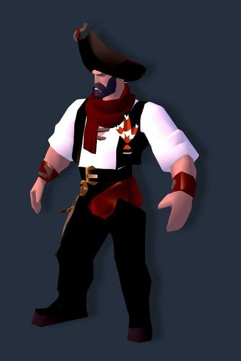
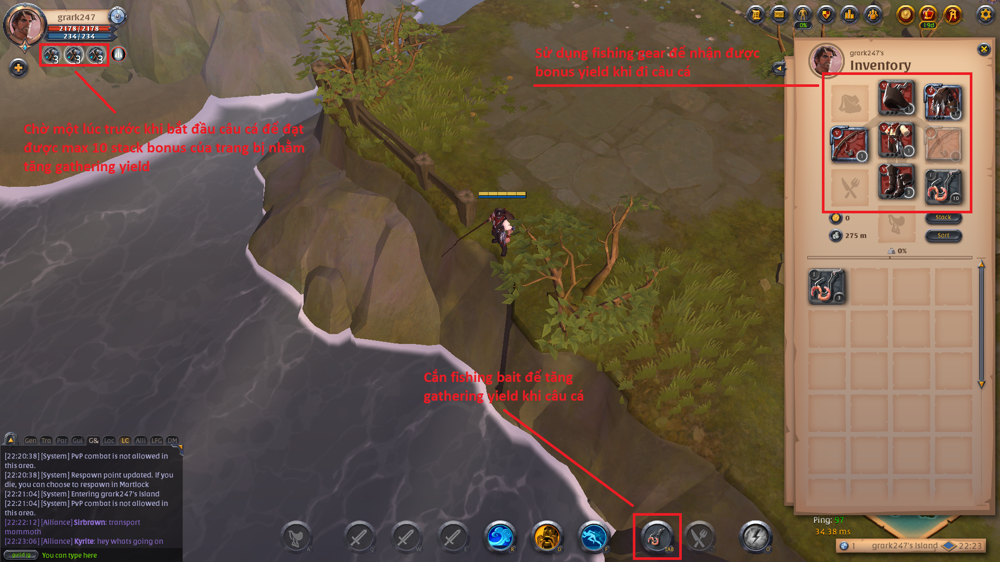
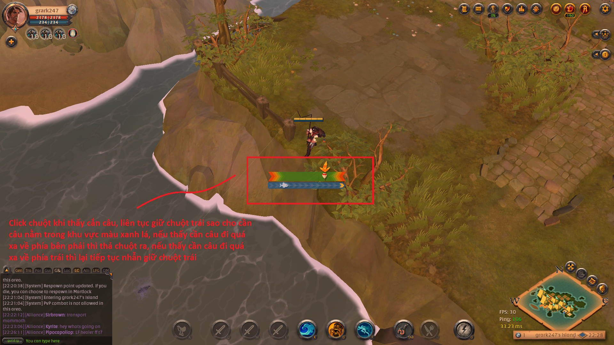

# Câu cá (Fisherman)

#### Giới thiệu

Câu cá là một trong các ngành nghề có thể dùng để kiếm tiền trong Albion Online. Không giống như những ngành nghề khác, trong bảng Destiny Board, nghề câu cá chỉ có 2 cấp độ: *Fisherman node* và *Fishing Specialist Node*. Khi lên level nhánh *Fisherman Node* sẽ giúp các bạn có thể sử dụng được cần câu cá và trang bị câu cá xịn hơn.

Mỗi level trong nhánh *Fisherman* sẽ giúp tăng **0.5** item power (IP) cho tất cả các trang bị câu cá, tăng tốc độ câu cá thêm **0.16** và tăng tỉ lệ câu được thêm nhiều cá lên **0.16%**.

Mỗi level trong nhánh Fishing Specialist sẽ giúp tăng **2.5** IP cho tất cả các trang bị câu cá, tăng tốc độ câu cá thêm **0.33** và tăng tỉ lệ nhận thêm được cá lên **0.33%**.

Sử dụng cần câu cá sẽ giúp các bạn có thể câu được cá có Tier +1 so với Tier của cần câu đang sử dụng. Ví dụ, nếu bạn đang sử dụng cần câu T5 (Expert's Fishing Rod), bạn có thể câu được các loại cá có Tier 1, 2, 3, 4, 5, và 6.

##### Hướng dẫn Cách Câu cá

Lưu ý: Khuyến khích các bạn liên tục di chuyển tìm các fishing node để có thể câu được các loại cá có giá trị cao