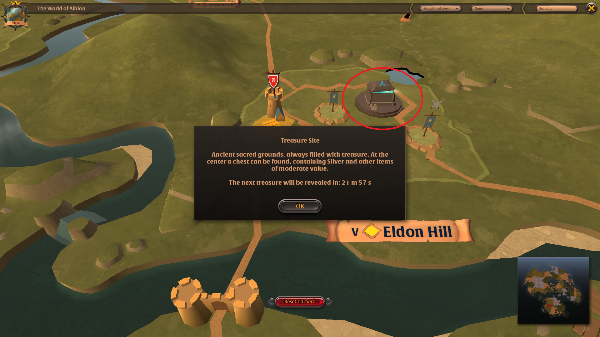

# Open World

### Giới thiệu

Trong Albion Online, Open World là một thuật ngữ nhằm ám chỉ các content nằm ngoài các cities (Martlock, Thetford, v..v..) như zone, territories, open world dungeons, random dungeons, castles, treasure chests, v..v..

#### Zones

Có 4 loại zone (map, bản đồ) trong Albion Online:

- Map xanh dương (An toàn tuyệt đối, chỉ PvP chết mất đồ nếu như cầm cờ Faction)
- Map vàng (PvP chết mất đồ nếu như cầm cờ Faction, Hellgate hoặc GvG. Bật red (flag up) đánh nhau chỉ bị gục hỏng đồ chứ không mất đồ. Lưu ý, nếu như bị gục sẽ mất 10% số nguyên liệu có trong người như gỗ, đá, bông, v..v.. Tất cả các trang bị gear sẽ bị hỏng 10%)
- Map đỏ (Cũng giống như map vàng, tuy nhiên có thể bật red (flag up) để đánh nhau, nếu chết sẽ mất hết đồ)
- Map đen (PvP tự do, chết mất đồ)

#### Territories

Territory (Lãnh thổ) là các khu vực thuộc quyền sở hữu của một guild hoặc alliance trong game. Người chơi nằm trong các guild hoặc alliance sở hữu lãnh thổ này có thể tự do ra vào mà không sợ bị lính canh tấn công. Các territory thuộc sở hữu của các guild trong cùng liên minh sẽ có màu tím trên bản đồ, các lãnh thổ thuộc sở hữu của guild mà người chơi đang là member sẽ có màu xanh. Đối với những lãnh thổ có màu đỏ, đây là những khu vực thuộc sở hữu của các guild không cùng liên minh, người chơi sẽ bị lính canh tấn công nếu như đi vào vùng lãnh thổ này.

Dưới đây là một số hình ảnh ví dụ để phân biệt lãnh thổ của đồng minh và kẻ thù:

#### Open World Dungeons

Open world dungeons là thuật ngữ để chỉ những khu vực cố định có tập trung nhiều quái (Khác với random dungeons). Có 4 loại open world dungeons trong Albion Online:

1. Khu vực quái bên ngoài boss thế giới
2. Khu vực quái tập trung gần nơi boss thế giới xuất hiện
3. Khu vực quái tập trung ở trong/ngoài dungeon lớn (Group dungeons)
4. Sepulcher of Magic (Khu vực quái farm magic essence)

#### Castles

Castles (Lâu đài) là những khu vực có thể chiếm đóng bởi một guild. Phần thưởng cho việc sở hữu castles bao gồm điểm season, rương kho báu, rương chứa đồ. Các guild muốn có được castles sẽ phải tham gia đánh ZvZ để giành được quyền sở hữu castles.

#### Rương Kho Báu

Rương kho báu chỉ xuất hiện ở những khu vực nhất định với khung giờ cố định. Có 2 loại rương kho báu người chơi có thể mở ra các phần thưởng ngẫu nhiên: Treasure Site và Relic Chest. Treasure site có thời gian reset là 1 tiếng trong khi Relic chest có thời gian reset ngẫu nhiên từ 1 cho tới 24 giờ (Tùy thuộc vào Tier của cái rương đó).

#### Warcamps

Warcamps là những khu vực có chứa rương đồ để người chơi có thể cất giữ các món đồ tạm thời khi chưa có thời gian để đem về lại thành. Cũng giống như bank ở các thành chính, đồ để trong warcamp sẽ không bị mất (Khác với đồ để trong rương territory).

Warcamp cũng là nơi dùng để phát động chiến tranh (Launch attack) nhằm đánh chiếm lãnh thổ (territory) nằm trong chính map đó. 

#### Faction Outposts

Faction outpost là các khu vực chỉ xuất hiện ở Royal continent (Map xanh, vàng, đỏ). Những outpost này chỉ có thể được chiếm giữ khi người chơi cầm khác cờ với cờ của outpost giết được boss bên trong outpost. Ví dụ, đối với outpost có cờ Fort Sterling, người chơi sẽ phải mang cờ Thetford, Martlock, Bridgewatch hoặc Lymhurst để đánh outpost này. Tiêu diệt boss canh giữ outpost sẽ đem lại cho người chơi điểm faction, điểm fame PvE, v..v..

#### Boss Thế giới

Boss thế giới chỉ xuất hiện ở những map nhất định trong Albion Online (Astolat, Torn Earth, Inis Mon, Blighted Bog, v..v..). Thông thường, để giết boss thế giới sẽ cần tới một party ít nhất 5 người. Tiêu diệt boss thế giới sẽ đem lại nhiều phần thưởn giá trị cho người chơi.

